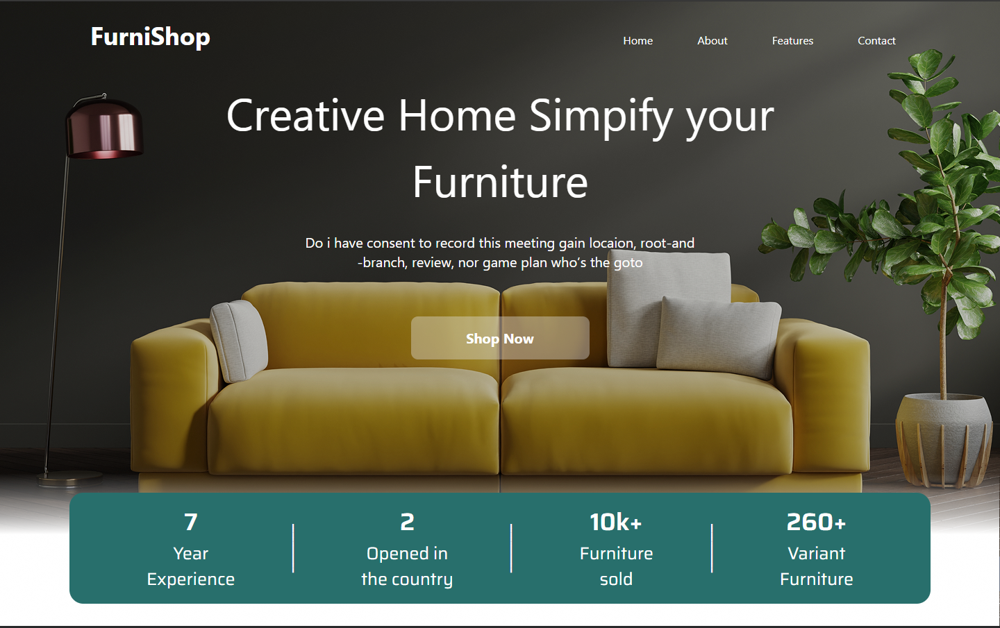
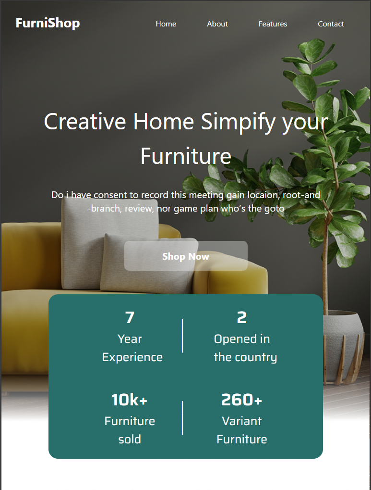
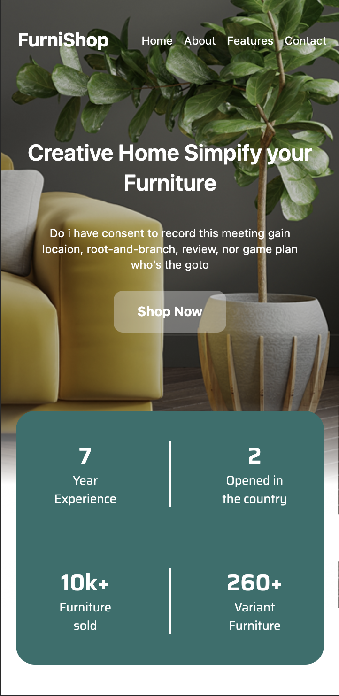

# FurniShop-LIMA

## Projeto
Pagina feita usando o framework Tailwind, sistemas de layout Flex e Grid, feito a partir de projetos no Figma, criado durante a disciplina de Linguagem de Marcação do curso na escola SENAI Jandira

Clique aqui(https://www.figma.com/design/3fhPKZeLdNySNB7BgcgJs4/lima---FurniShop--Copy-?node-id=2001-49&t=IKu3VgUUX89DQlAu-0) para ver meu figma

## Página versão Desktop

## Página versão Tablet

## Página versão Celular

## Tecnologias
* HTML
* Tailwind
* CSS
* GIT
* Markdown

## Autor
[Vitor Miguel](https://www.linkedin.com/in/vitor-miguel-673806350/)
