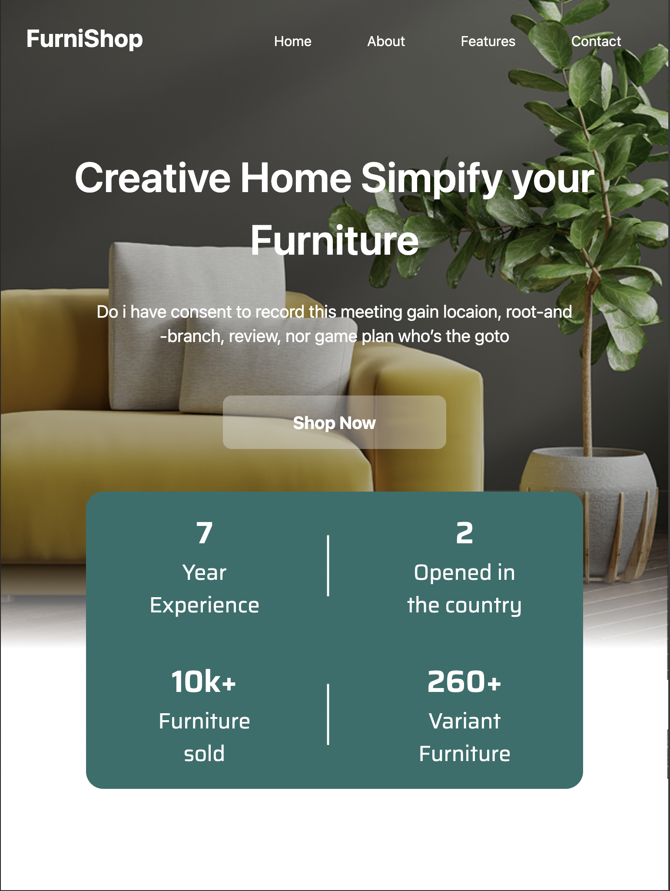

# FurniShop-LIMA

## Projeto
Página feita usando o framework Tailwind, sistemas de layout Flex e Grid, feito a partir de projetos no Figma, criado durante a disciplina de Linguagem de Marcação do curso na escola SENAI Jandira

Esta é a tela inicial (landing page) da FurniShop, uma loja fictícia de móveis modernos e criativos. O design tem foco na simplicidade, sofisticação e clareza da proposta da marca: "Creative Home Simplify your Furniture".

## Funcionalidades apresentadas na tela:
Header com navegação: Links para as seções principais — Home, About, Features e Contact.

*Seção principal com chamada para ação: Apresenta um título chamativo, subtítulo (a ser ajustado futuramente) e botão de destaque "Shop Now".

*Imagem de destaque: Sofá moderno com ambientação decorativa (luminária e planta).

*Destaques da empresa: Bloco inferior com indicadores-chave da loja:

*7 anos de experiência

*2 lojas abertas no país

*Mais de 10 mil móveis vendidos

*Mais de 260 variações de móveis disponíveis

## Responsividade
A tela foi desenvolvida para ser totalmente responsiva, com versões adaptadas para:

*Desktop: Layout amplo com espaçamento generoso e centralização do conteúdo.

*Tablet: Componentes reorganizados em uma coluna central para facilitar a leitura e navegação.

*Mobile: Otimização de botões, textos e espaçamentos para telas menores.

Clique [aqui](https://www.figma.com/design/3fhPKZeLdNySNB7BgcgJs4/lima---FurniShop--Copy-?node-id=2001-49&t=IKu3VgUUX89DQlAu-0) para ver meu figma

## Página versão Desktop

## Página versão Tablet

## Página versão Celular

## Tecnologias
* HTML
* Tailwind
* CSS
* GIT
* Markdown

## Autor
[Vitor Miguel](https://www.linkedin.com/in/vitor-miguel-673806350/)
